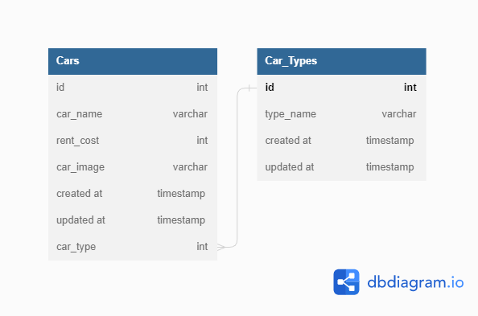

# Binar Academy FSW 3 - Binar Car Management Dashboard

Created By : Trisna Wahyudi

# How To Use This Project

Open 2 terminal on this project then :

## on server directory :

1. change the config/config.json file with your postgre username and password
2. type `npm i` then press enter
3. type `sequelize db:create` then press enter
4. type `sequelize db:migrate` then press enter
5. type `sequelize db:seed:all` then press enter
6. npm `run start` / `yarn start`!

## on client directory :

1. type `npm i` then press enter
2. npm `run start` / `yarn start`!

# ERD

# Client Side

1. Halaman Index (GET) = http://localhost:8000/
2. Halaman Create Car (POST) = http://localhost:8000/create-car
3. Halaman Edit Car (GET) = http://localhost:8000/update-car/:id
4. Request Edit Car (POST) = http://localhost:8000/update-car/:id
5. Menampilkan Hasil Filter (GET) = http://localhost:8000/:id
6. Delete Car (DELETE) = http://loocalhost:8000/delete-car/:id

# Server Side

1. Create Car (POST) = http://localhost:5000/api/v1/cars
2. Read All Cars (GET) = http://localhost:5000/api/v1/cars
3. Read One Car (GET) = http://localhost:5000/api/v1/cars/:id
4. Filter Car by Id (Get) = http://localhost:5000/api/v1/cars/type/:id
5. Update Car (PUT) = http://localhost:5000/api/v1/cars/:id
6. Delele Car (GET) = http://localhost:5000/api/v1/cars/:id

# NB

-   fitur search belum bisa digunakan.
